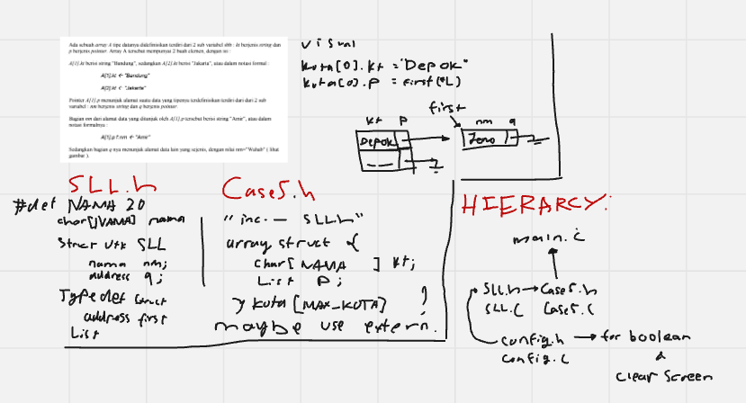
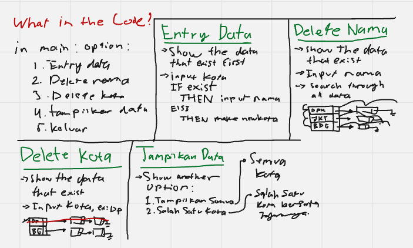

# Array-to-LinkedList

## Tentang Program ADT ini
Akan diberi 5 opsi untuk dipilih, tentang basic dari `array` to `linked list`.\
Menggunakan studi kasus yang berupa `array` kota yang menunjuk ke `linked list` nama-nama orang\
dengan **opsi terdiri dari**:

### **1. Entry Data**
- Untuk Memasukkan nama kota baru atau nama orang
- Akan otomatis membuat nama kota baru jika tidak ada nama kota yang terdaftar
> **Catatan!**\
> Nama kota hanya bisa terdaftar sampai 10 
- Jika nama kota terdaftar, akan memunculkan input nama

### **2. Delete Nama** 
- Akan memunculkan semua data terlebih dahulu
> Contoh!\
> === DATA SAAT INI ===\
Bandung -> Amir -> Budi\
Jakarta -> Citra -> Dodi\
 ================
- Kemudian input nama yang akan didelete lalu mencari ke seluruh array dan linked list
- Jika terdapa nama yang sama di dua kota berbeda, maka dua-dua nya akan terdelete

### **3. Delete Kota**
- Akan memunculkan semua data terlebih dahulu
> Contoh!\
> === DATA SAAT INI ===\
Bandung -> Amir -> Budi\
Jakarta -> Citra -> Dodi\
 ================
- Kemudian input nama kota
- Semua `linked list` yang tertunjuk oleh kota itu akan juga terdelete

### **4. Tampilkan Data**
- Akan diberi dua opsi
> 1. Tampilkan Semua
> 2. Salah satu kota
- Jika memilih opsi 1, maka akan menampilkan semua data
- Jika memilih dua maka akan menampilkan kota yang sudah di input, beserta `linked list` yang tertunjuk

### **5. Keluar**
- Keluar dari program

## Lesson Learn
- Mengetahui bagaimana caranya sebuah `array` menunjuk ke sebuah `linked list`
- Mengetahui caranya Meng-search ke semua array dan `linked list` untuk mencari sebuah nama yang spesifik (menghiraukan upper dan lower case)
- Mengetahui Extern

## Penggambaran Awal Program

### **Referensi**
> https://github.com/KhuzaimaAwan47/Array-Implementation-of-Linked-List
> https://github.com/ChrisRackauckas/LinkedLists.jl
> Deepseek
